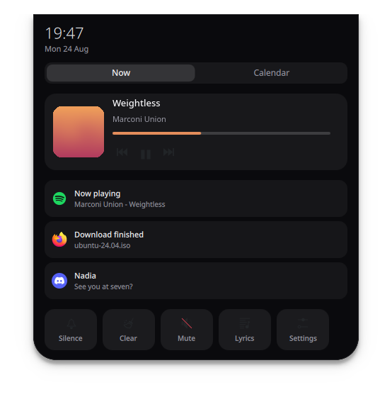
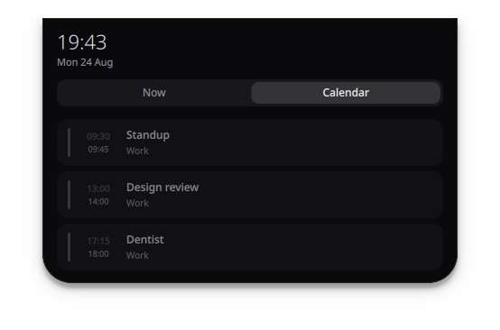
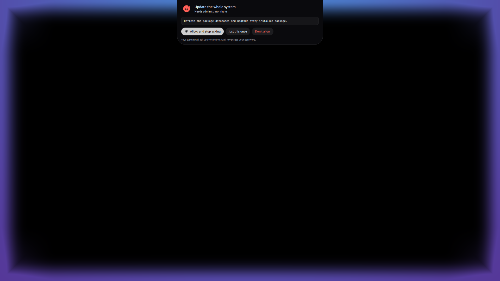
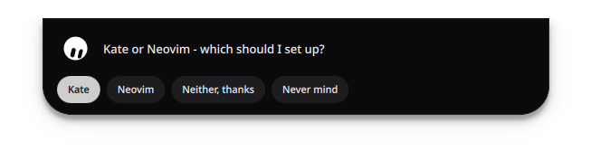
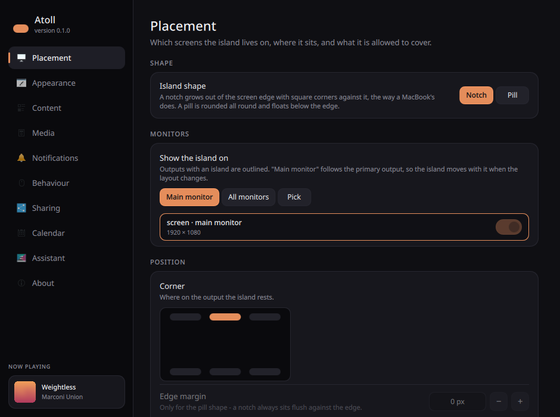

# Atoll

**A dynamic island for KDE Plasma.**

Atoll is a small overlay that grows out of the edge of your screen and morphs to
show whatever just happened: the volume you changed, the notification that
arrived, the track that started playing. Click it and it unfolds into a
dashboard: a full transport, synced lyrics, your notification backlog, a few
toggles, and - when you give it a calendar to read - what is on it today.
Right-click it for the settings window.

By default it is a **notch**: square corners against the screen edge, rounded
ones below, flush with the bezel the way a MacBook's is. It can also be a
**pill** that floats below the edge instead - one setting away.

It sits *over* the shell rather than beside it: on the overlay layer, ignoring
the space panels reserve, so it can cover a Plasma panel instead of being
pushed below one. With one line in its desktop file it can also stay up while
the session is locked - see [On the lock screen](#on-the-lock-screen).

It is a native Qt 6 / QML application built on `wlr-layer-shell` — no
Quickshell, no AGS, no Hyprland. It runs as a normal program on any Wayland
compositor that speaks layer-shell, and it is built to fit Plasma in
particular.


## What it does

| State | What you see |
|---|---|
| **Idle** | The clock, the cover of whatever is playing and a dot for anything waiting - the island always has something to show. A satellite blob buds off it while music plays. |
| **OSD** | Volume, brightness, microphone, keyboard layout, power profile — anything Plasma announces. |
| **Notification** | App icon or image, summary and body, with a progress bar for the notifications that carry one. |
| **Media** | Album art, scrolling title, album, spectrum, and transport controls that fade in on hover. While synced lyrics exist, the second line becomes the words being sung. |
| **Expanded** | Clock, battery, seekable transport, a scrolling lyrics panel, notification history and quick toggles, on one tab - and today's calendar on the other. |
| **Calendar** | Point Atoll at an ICS feed and the dashboard's second tab fills with today's events. The pill mentions the next one when it is less than an hour away. |
| **Sharing** | Drag files onto the island and it turns into a drop target, then a list of the devices nearby. Files coming the other way ask before they land. |
| **Assistant** | Hold the island. The screen edges light up, a question box opens, and Claude or Gemini answers — and, one permission at a time, does the thing. When it needs a decision from you, the answers arrive as buttons on the island. |

### How it gets its information

Atoll never takes anything over. It does not replace your notification daemon
and it does not replace Plasma's OSD:

- **OSD events** are read by watching the method calls Plasma already sends to
  `org.kde.osdService`. That means hardware keys, third-party mixers and
  Plasma's own applets all reach the island without polling PipeWire.
- **Notifications** are read the same way, by asking the bus daemon to make
  Atoll a monitor. Your real daemon — Plasma's, dunst, whatever you run —
  keeps doing its job; Atoll mirrors it. Pairing each observed `Notify` call
  with its reply also recovers the id the daemon handed out, which is what
  makes closing a notification from the island possible.
- **Media** is plain MPRIS2, so Spotify, a browser tab and a local player all
  reach the island the same way: title, artist, album, cover art and position.
  Remote cover art (Spotify hands out an https URL) is fetched once and cached.
- **Lyrics** come from an `.lrc` file next to a local track when there is one,
  and otherwise from [lrclib.net](https://lrclib.net). See [Network](#network)
  for everything Atoll ever sends anywhere.
- **Calendar events** come from ICS feeds you subscribe to - the `webcal://` or
  `https://` address Google Calendar, iCloud, Nextcloud and Outlook all hand
  out. Atoll reads them on a timer, expands repeating events itself, and never
  writes anything back.
- **Nearby devices** are found over the LocalSend protocol: a multicast group
  everyone announces themselves into, and a small HTTP server for the files
  themselves. See [Sharing files](#sharing-files).
- **The accent colour** follows the dominant colour of the current album art.

### Where it appears

By default: one island, on the main monitor, centred at the top, drawn over
whatever Plasma has there. All three parts of that are settings.

- **Screens** - the main monitor (which it keeps following when you dock,
  undock or change which output is primary), every monitor at once, or a
  hand-picked set. Plugging a monitor in or out adds and removes islands by
  itself.
- **Shape** - a notch flush with the edge, or a floating pill.
- **Position** - any of the six edge positions, with margins.
- **Stacking** - which compositor layer to sit on, and whether to cover panels
  or make room for them.

## Installing

### Arch, in one go

```sh
git clone https://github.com/jojo2k7/atoll.git
cd atoll
./scripts/install.sh
```

That installs what is missing, builds, installs into `/usr` and starts the
island as a user service, so it comes back with every login. It asks before it
installs the optional extras, and the only step it runs as root is the install
itself.

From the AUR, once it is published there: `yay -S atoll` for a release, or
`yay -S atoll-git` to follow the development branch. Both PKGBUILDs live in
[`packaging/`](packaging).

### By hand

Dependencies: `qt6-base qt6-declarative qt6-svg layer-shell-qt kcoreaddons ki18n dbus wayland`,
plus `cmake ninja qt6-shadertools extra-cmake-modules wayland` to build
(`wayland-scanner` generates the lock-screen protocol; without it everything
else still builds).
Optional: `claude-code` for the assistant, `cava` for a real spectrum,
`wireplumber` for volume control, `openssl` for encrypted sharing (see
[Sharing files](#sharing-files)), `polkit` and a polkit agent so the assistant
can ask for administrator rights, `libsecret` to keep an API key in your
keyring, and `xdg-desktop-portal-kde` to let it look at your screen.

```sh
cmake -S . -B build -G Ninja -DCMAKE_BUILD_TYPE=Release -DCMAKE_INSTALL_PREFIX=/usr
cmake --build build
sudo cmake --install build
```

Start it with `atoll`, or enable the bundled user service:

```sh
systemctl --user enable --now atoll.service
```

Two things are worth doing from an installed copy rather than a build
directory: the lock screen (see [below](#on-the-lock-screen)) and the
assistant, whose permission gate is the installed binary itself.

## The dashboard

Click the island and it unfolds. The clock and the date sit at the top, then
whatever is playing with a seekable bar and its transport, then the
notifications you have not dealt with, then a row of toggles.



Which transport buttons are there is yours to choose under **Settings → Media**:
shuffle, previous, play/pause, next and repeat, in that order, with the classic
three shown when you have never said otherwise (`media.transportButtons`).

### Calendar

The dashboard has a second tab, and what fills it is any ICS feed you point
Atoll at. Google Calendar, iCloud, Nextcloud and Outlook all publish one;
`webcal://` and `https://` are both accepted, and the feed is fetched on a
timer and parsed on this machine - repeating events, exceptions and all-day
events included. The tab is there whether or not you have added a feed; turn
`modules.calendar` off and it goes away.



Add feeds under **Settings → Calendar**, or write them into the config:

```json
"calendar": {
  "sources": [
    { "name": "Work", "url": "https://example.com/work.ics" }
  ]
}
```

| Key | Default | Meaning |
|---|---|---|
| `modules.calendar` | `true` | The calendar tab and everything below it. |
| `calendar.sources` | `[]` | The feeds, each `{"name": ..., "url": ...}`. With none the tab is empty. |
| `calendar.lookaheadHours` | `24` | How far ahead an event counts as upcoming. |
| `calendar.fetchIntervalMinutes` | `15` | How often the feeds are re-read. |
| `calendar.showInIdle` | `true` | Whether the pill mentions the next event when it is under an hour away. |

Nothing is written back to the calendar: the feeds are read-only to Atoll, and
an ICS URL is all it ever asks for.

## The assistant

Press and hold the island. The edges of the screen light up, and a box opens
asking what you want.



You can ask it things ("why is my fan so loud", "what is taking up my disk"),
and you can ask it to *do* things ("install Firefox and make it the default",
"update my system", "set my wallpaper to that photo from Tuesday"). It works on
this machine, with the tools it has been given: run a command, read and write
files, install packages, change a Plasma setting, open an app, take a look at
the screen.

### It asks before it acts

Every action the assistant wants to take is sorted into one of three tiers
before it happens, and the assistant does not get to choose the tier — Atoll
looks at what the action would actually do:

| Tier | What it covers | What happens |
|---|---|---|
| **Reads** | Listing a directory, reading a file, `pacman -Q`, `systemctl status` | Runs straight away. Nothing here is anything you could not have looked at yourself. |
| **Changes your session** | Writing in your home directory, changing a Plasma setting, opening an app | Asks. |
| **Administrator** | Installing packages, a system upgrade, anything as root | Asks, and then **your desktop** asks — the ordinary polkit dialog, which honours a password, a fingerprint or a hardware key exactly as it does everywhere else. |

The first button on that question is **Allow, and stop asking**, and it is the
one most people want: you asked for a job to be done, not to be consulted about
each of the four commands it turns out to take. Say it once and the assistant
carries on by itself for the rest of the conversation, reporting each step on
the island as it goes; the panel says *acting on its own* while it does, and
**Stop** ends it at any point. *Just this once* answers only the step in front
of you. Starting a new conversation forgets the whole arrangement.

What that permission cannot do is widen the rules: anything refused outright
stays refused, a tier switched off in the settings stays unreachable, and every
root step still meets your desktop's own password dialog, which is not Atoll's
to waive.

That gate is the same one however the assistant is connected. When the answer
comes from the Claude Code client, the client carries out its own tool calls -
so Atoll stops each one before it happens, asks here, and tells the client what
you said. A refusal reaches the model as an answer, and it moves on.

The point of that middle column is that a model asking nicely for root does not
get it. If the work fits inside your own account, that is where it runs.
Atoll never sees, stores or types your password, and a handful of operations —
wiping a disk, rewriting the password database, piping a download straight into
a shell — are refused no matter who asks or how the request is worded. Your
keys, `~/.ssh`, `~/.gnupg` and your keyring are never opened for it at all.

You decide how much of this is on at all, under **Settings → Assistant**:
*Look only* never changes anything, *Ask first* is the default, *Trust it*
stops asking about your own files but still sends every root action through
polkit. Administrator access can be switched off outright.

### It can ask you back

The assistant is not only answering: sometimes it needs a decision from you -
which of two ways to do something, which of three files you meant, whether to
go ahead. There is no keyboard in front of you at that moment, only the island,
so a question like that is not written into the answer where nobody can reply
to it. It arrives as a line of text with the answers underneath it as buttons,
and the one it would recommend is the one that looks like the answer. Tap one
and it carries on with what you said; **Never mind** closes the question, which
the assistant is told about and works around.



A script of your own can put the same question up with
`atollctl choose "Which one?" "This" "That"`, which prints back whichever
answer was tapped.

### Looking at the screen

Ask *what do you see* and the assistant takes one picture rather than asking
you to describe your desktop. With more than one monitor it asks which one
first, as buttons on the island: **this screen** (the one your pointer is on),
each of the others by name, or **all of them**.

That question is worth asking. Everything sent to a model is scaled down to fit
inside a box about 1568 pixels across, so one monitor arrives with its window
titles legible while three side by side arrive as a strip in which nothing can
be read. Your answer holds for the rest of the conversation, and a new
conversation starts asking again. **Settings → Assistant** sets where that
starts from - *ask me*, *the one I am on*, or *all of them* - and how much
detail the picture keeps.

Your desktop still asks before any picture is taken. Atoll does not work around
that dialog, and there is no route to the screen that skips it.

### Long jobs

A system upgrade takes a while, and you should not have to watch it. Press
**Continue in background**: the glow goes away, the panel closes, and the
island keeps a small face on the pill that reports progress. Click it to bring
the conversation back. If the assistant needs an answer from you, it comes back
by itself.

### Connecting it

There is no Atoll account and no server in between. Your question goes from
your machine to whichever service you picked, and nowhere else.

Hold the island before you have set one up and it offers to open the settings
for you. Under **Settings → Assistant** there are three ways in:

| | What it needs | Where the answer comes from |
|---|---|---|
| **Claude Code** | An account you sign in to once | The `claude` client on this machine, using your subscription |
| **Claude API** | A key from [console.anthropic.com](https://console.anthropic.com) | Anthropic, billed per question |
| **Gemini** | A key from [aistudio.google.com](https://aistudio.google.com) | Google, billed per question |

**Claude Code is the default**, because it is the one with nothing to set up:
no billing page to find, no key to create, nothing to paste. If the client is
missing, the settings page shows the one command that installs it; if it is
installed but signed out, the **Sign in** button opens a terminal on
`claude auth login` and you are done after that. Atoll then runs the client for
each question and reads the answer back onto the island.

The client is run deliberately narrowly. It is started with none of its own
configuration — no project instructions, no plugins, no skills, no saved
transcript — because the assistant on your island should behave the same on
every machine, and a question asked on a pill does not belong in a log you did
not ask for. What it *is* given is Atoll's own instructions and a gate: every
tool call it wants to make stops at the island first, where the same rules and
the same dialog decide it as for every other way of connecting.

If you use an API key instead: with `libsecret` installed the key goes into
your keyring, encrypted at rest and unlocked with your login; otherwise into a
file only you can read, and the settings page says which happened.
`ANTHROPIC_API_KEY` and `GEMINI_API_KEY` from your environment are picked up as
well, so a machine that is already set up needs no configuration.

### The glow, and the colour of it

The edge light is one fixed gradient: the assistant's colour where it leaves
the island, easing into a second colour by the far corners, fading in when the
panel opens and out when it closes. It does not follow the album art and its
hue does not travel along the border - a light that changes colour with the
music, or cycles while you read, is motion at the edge of your eye for as long
as the assistant is open. Both colours are yours to set under **Settings →
Assistant**, along with how bright and how wide the band is.

The panel itself is white for the same reason. Everything else on the island
picks up the colour of whatever is playing; the assistant is the one thing that
has nothing to do with it, so it keeps one colour of its own.

Turn the whole thing off with **Settings → Assistant → Assistant**, and the
long press, the glow and every line of it go away.

## On the lock screen

Atoll can stay visible while the screen is locked. KWin only hands the
`kde_lockscreen_overlay_v1` protocol to programs that ask for it by name, so
this needs two things:

- Atoll must be **installed**, not run from a build directory. KWin matches the
  running executable against the `Exec=` line of `io.github.atoll.Atoll.desktop`,
  which is why that line carries an absolute path and
  `X-KDE-Wayland-Interfaces=kde_lockscreen_overlay_v1`.
- `lockScreen.enabled` must be on. The permission is asked for before the
  window is mapped, so changing it takes a restart of the island.

What the island shows there is deliberately narrower than what it shows on an
unlocked desktop, because anybody walking past can read it:

| Key | Default | Meaning |
|---|---|---|
| `lockScreen.showMedia` | `true` | Cover, title and artist stay visible. |
| `lockScreen.showNotifications` | `false` | Notification summaries and bodies stay hidden. |
| `lockScreen.allowExpanding` | `false` | The dashboard - and with it the notification history - cannot be opened. |

Locking the screen also collapses an open dashboard.

## Settings

`atoll --settings`, `atollctl settings`, a right-click on the island, or the
gear in the dashboard opens the settings window. It runs as its own process and
edits the same file the island watches, so every switch lands on the island as
you flip it - there is no apply button.



## Controlling it

Atoll exposes `org.atoll.Atoll` on the session bus, which makes the island a
general purpose heads-up display for your own scripts:

```sh
atollctl text drive-harddisk "Backup finished"
atollctl progress cloud-upload 64 "Uploading"
atollctl share ~/Pictures/holiday.jpg
atollctl ask "why is my laptop fan so loud"
atollctl screenshot DP-1
atollctl screens
atollctl choose "Which editor should I set up?" "Kate" "Neovim"
atollctl toggle
atollctl dismiss
atollctl settings
```

`atollctl dismiss` closes whatever has the island's attention - the assistant,
a notification sitting there waiting to be read - and leaves it at rest.
`atoll --dismiss` is the same call by another name, as are `atoll --toggle`,
`--expand`, `--collapse`, `--ask "..."` and `--quit`: each one hands the verb to
the running island over the bus and exits.

`atollctl screenshot` asks the desktop for one picture of the screen, writes it
where the assistant can open it and prints the path. It is also how the
assistant looks at the screen itself, so a question like *what do you see* is
answered rather than turned back into a request for a screenshot. Name an
output to take that one, `all` for every screen in one picture, or leave it out
and the island asks which one you meant. `atollctl screens` lists what there is
to choose between.

`atollctl choose` puts a question on the island as buttons and prints back the
one that was tapped, or a line starting `error:` if the question was closed.
It is how the assistant asks you something when it is running as the
command-line client, and it works just as well from a script of your own.

```sh
atollctl assistant           # open it with an empty box
```

Binding `atollctl assistant` to a key in **System Settings → Shortcuts** gives
the assistant a shortcut of its own, for the times the island is not where the
pointer is.

Interaction: click to expand, **hold** for the assistant, right-click for the
settings, middle-click to play/pause, scroll to change volume, hover to reveal
transport controls. Every one of those is configurable. Scrolling changes the
volume only while the island is at rest - with the dashboard open or the
assistant in front, the wheel is left alone.

## Sharing files

Drag files - or a whole folder - onto the island. It grows into a drop target
while the drag is over it, and once the files are dropped it lists the devices
it can see; click one and they go. Files arriving the other way announce
themselves the same way, with an Accept and a Decline, and land in your
downloads folder.

**It speaks [LocalSend](https://localsend.org), not AirDrop.** AirDrop has been
reverse-engineered - by the Open Wireless Link project, and more recently by
Google for the Pixel's Quick Share - but on Linux it remains impractical: it
rides on AWDL, Apple's own link layer, and the open implementations need a
wifi card that can be driven in monitor mode with frames injected into it,
which takes the card off the network it was on. LocalSend is documented, has
an app on every platform including iOS and Android, and needs nothing but the
network you are already on. So: install LocalSend on the phone, and the notch
is the desktop half of it.

How it works, briefly:

- Devices find each other on the multicast group `224.0.0.167:53317`, and
  answer each other over HTTP. Nothing leaves the local network, and there is
  no account and no server anywhere.
- Transfers are TLS between two self-signed strangers: the SHA-256 of the
  certificate *is* a device's identity in this protocol, so nothing is
  verified against a certificate authority. Atoll makes its certificate on
  first run with `openssl` and keeps it in `~/.local/share/atoll`. Without
  `openssl` installed sharing falls back to cleartext HTTP, which the
  LocalSend app will not connect to.
- The port is 53317, or the next free one - so Atoll and the LocalSend app can
  run side by side on the same machine.

| Key | Default | Meaning |
|---|---|---|
| `modules.sharing` | `true` | The drop target and the discovery of nearby devices. |
| `sharing.alias` | hostname | How this machine introduces itself. |
| `sharing.receive` | `true` | Whether incoming files are accepted at all. |
| `sharing.autoAccept` | `false` | Take offered files without asking. |
| `sharing.saveDirectory` | your downloads | Where received files land. |
| `sharing.port` | `53317` | HTTP and multicast port. |

`atollctl share <file>...` offers files from a script or a file manager's
"send to" menu, exactly as if they had been dropped on the island.

## Configuring

`~/.config/atoll/atoll.json` is written on first run with every default
spelled out, and it is re-read live — save the file and the island changes
while you watch. Keys you are most likely to want:

| Key | Meaning |
|---|---|
| `island.screens` | `["primary"]`, `["all"]`, or output names such as `["HDMI-A-1", "DP-2"]`. |
| `island.shape` | `"notch"` sits flush against the edge, `"pill"` floats below it. |
| `island.position` | `"top-center"`, `"top-left"`, `"top-right"`, or the three `bottom-*` variants. |
| `island.overlapPanels` | `true` draws over Plasma's panels; `false` respects `island.exclusiveZone`. |
| `island.layer` | `"overlay"`, `"top"`, `"bottom"` or `"background"`. |
| `island.idleMode` | `"auto"`, `"clock"`, `"notch"` or `"hidden"`. |
| `island.alwaysVisible` | Keeps the island on screen even in `"hidden"` mode. |
| `appearance.accent` | `"auto"` follows the album art, or pin a colour. |
| `effects.gooey` | The metaball merge between the island and its satellite. |
| `notifications.ignoredApps` | Apps the island should stay quiet about. |
| `media.preferred` | Player names to favour, in order. |
| `lyrics.enabled` | Whether to look lyrics up at all. |
| `lyrics.offsetMs` | Shifts every lyric line, for players that report position late. |
| `sharing.autoAccept` | Take offered files without asking first. |
| `media.transportButtons` | Which of `shuffle`, `previous`, `playPause`, `next`, `repeat` the dashboard shows. |
| `calendar.sources` | ICS feeds to read, each `{"name": ..., "url": ...}`. |
| `ai.provider` | `"claude-cli"` signs in with the Claude Code client, `"anthropic"` and `"gemini"` use an API key. |
| `ai.cliPath` | Where that client lives, for the installs Atoll does not find by itself. |
| `ai.permissions.mode` | `"readonly"`, `"guarded"` or `"trusted"` - the same choice as in the settings window. |
| `ai.screen` | Which monitor it looks at: `"ask"`, `"current"`, `"all"`, or an output name. |
| `ai.screenshotMaxEdge` | Longest edge of the picture it is sent, in pixels. `1568` is what the services keep. |
| `ai.glowColor` / `ai.glowColorFar` | The two ends of the edge light's gradient. |
| `lockScreen.enabled` | Whether to ask to stay visible while the session is locked. |

Configs written before islands could span outputs still work: an
`island.screen` string is used when `island.screens` is missing.

## Network

Atoll has no server of its own and no account. Everything it can reach out to
is listed here, and each one is off unless the thing that needs it is on.

- **Lyrics**, while `lyrics.enabled` is on and a track has no local `.lrc`
  file: a lookup at `lrclib.net` carrying the artist, title, album and duration
  of what is playing. Results are cached under `~/.cache/atoll/lyrics`. Turn it
  off in the settings window under *Media and lyrics*, or with
  `"lyrics": { "enabled": false }`.
- **Cover art**, from whatever URL the player advertises - Spotify hands out an
  https link rather than a file. That is the player's server, not ours, and
  fetched art is cached.
- **Calendar feeds**, but only the ones you added yourself, and only while
  `modules.calendar` is on: a GET of each ICS URL every
  `calendar.fetchIntervalMinutes`. Nothing is ever sent back to them.
- **The assistant**, and only while you are asking it something: your question
  goes to the service you connected it to, and nothing goes anywhere while it
  sits idle. A picture of your screen goes with it only when you asked for one,
  and your desktop asks you before it is taken.

Connected through Claude Code, the assistant's traffic is the client's own -
Atoll starts it, writes the question to it and reads the answer back - so it
uses the account you signed that client in with. Turn the assistant off under
*Settings → Assistant* and that path is not taken at all.

Sharing is local traffic only: a multicast announcement on `224.0.0.167:53317`
and HTTP(S) straight between the two devices. Turn the whole thing off with
`"modules": { "sharing": false }` and Atoll stops listening and announcing.

## Troubleshooting

| Variable | Effect |
|---|---|
| `ATOLL_DEBUG_STATE=1` | Logs every state change and incoming event. |
| `ATOLL_DEBUG_SURFACE=1` | Paints the whole layer surface so its bounds are visible. |
| `ATOLL_DEBUG_GRAB=<path>` | Saves one rendered frame and exits (`ATOLL_DEBUG_GRAB_DELAY` in ms). |
| `ATOLL_NO_LAYER_SHELL=1` | Falls back to an ordinary window, for X11 or a nested compositor. |

If the island says it cannot watch the session bus, the bus daemon refused
`BecomeMonitor`; media control still works but OSD and notification mirroring
do not.

## Known limitations

- Notification **actions** are best effort. As a bus observer Atoll can
  re-broadcast `ActionInvoked`, but senders that filter on the daemon's bus
  name will ignore it.
- One island process per session. It serves every output you asked for; a
  second instance refuses to start.
- Staying on the lock screen only works on KWin, and only for an installed
  Atoll. Other compositors do not offer the protocol, and the island then
  disappears with the session like any other window.
- Sharing is LocalSend, not AirDrop: an Apple device needs the LocalSend app
  to appear in the list. Sending to the LocalSend app also needs `openssl`
  present when Atoll first runs, because that app refuses cleartext peers.
- The assistant answers through somebody else's service, and Atoll has no
  arrangement with any of them. Through Claude Code it uses the account you
  signed that client in with; through an API key it costs whatever the provider
  charges per question. Atoll adds nothing to that and takes no cut, and there
  is no service of ours to fall back on.
- What the assistant can do is bounded by the tools it has and by the
  permission tiers above, not by how convincing its explanation is. It is still
  a language model: read the command in the prompt before you allow it, the
  same way you would read a command somebody pasted into a forum answer.
- Lyrics are only as good as the database. Anything lrclib has never seen shows
  as "No lyrics for this track"; an `.lrc` file next to a local track always
  wins.

## License

GPL-3.0-or-later. See [LICENSE](LICENSE).
